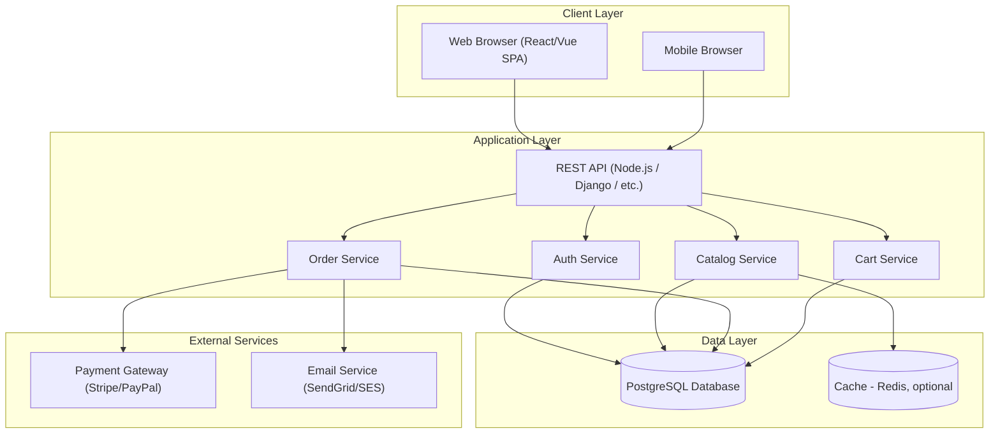
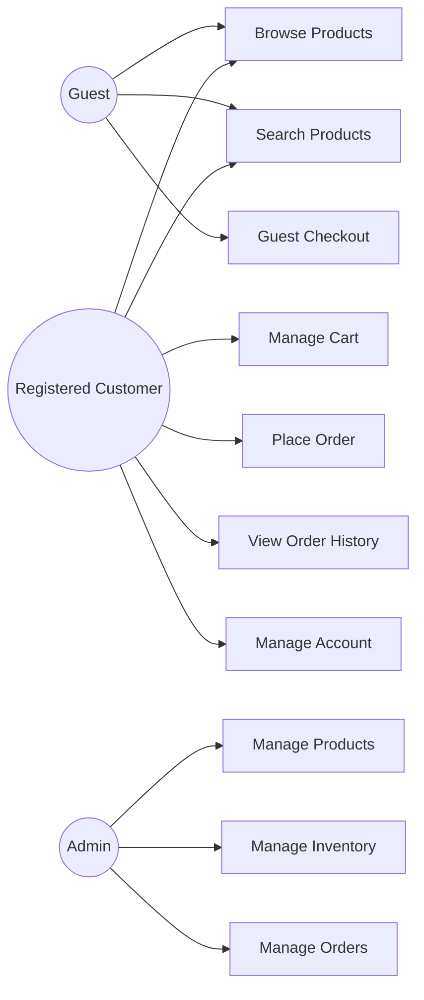
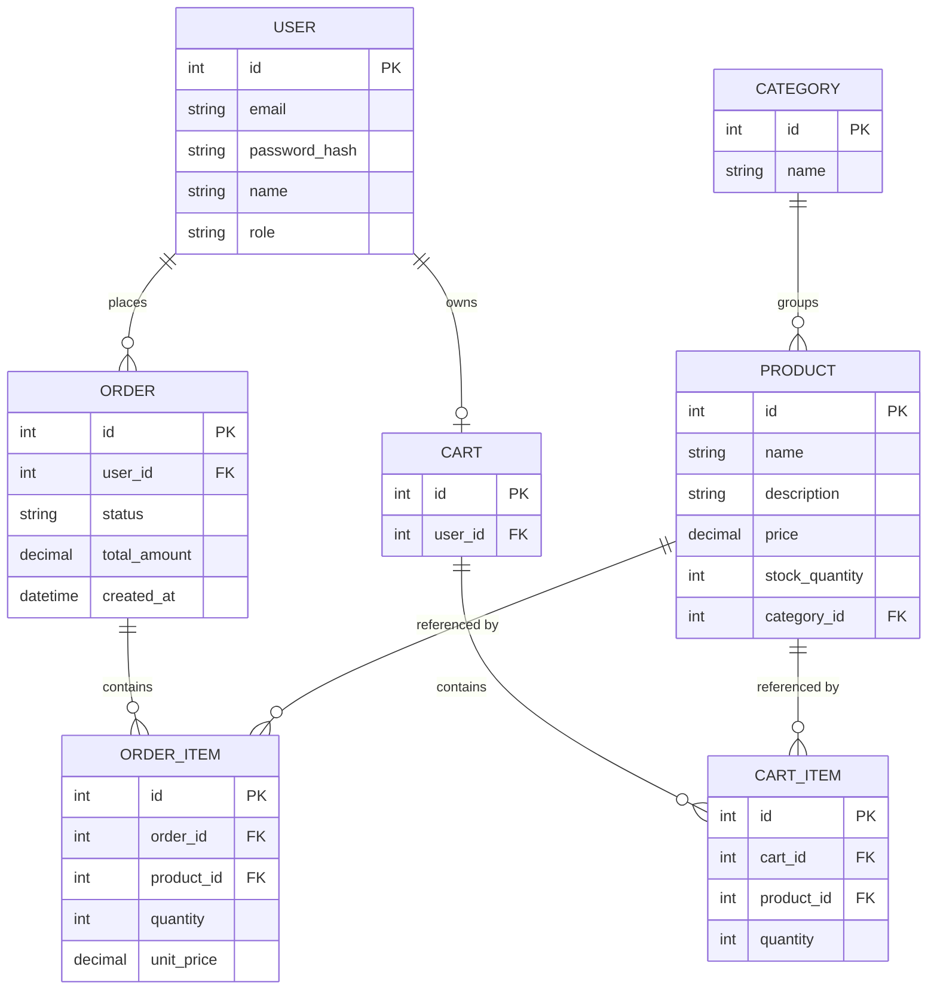
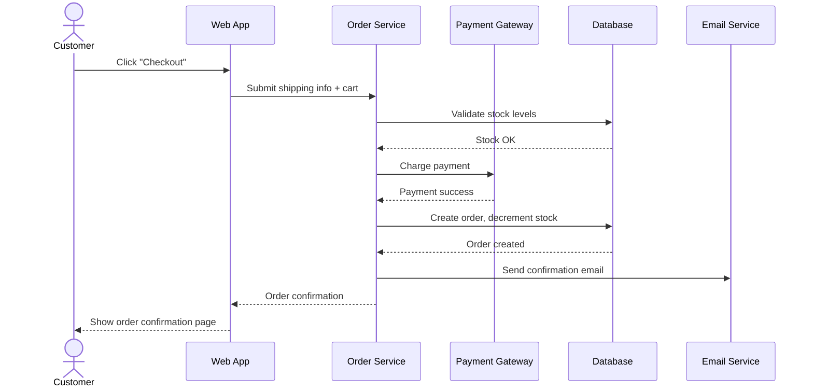

# Software Requirements Specification (SRS)
## Small E-Commerce Platform

**Version:** 1.0
**Date:** September 12, 2026

---

## 1. Introduction

### 1.1 Purpose
This document specifies the functional and non-functional requirements for a
small e-commerce web application. It is intended for developers, testers,
and project stakeholders as the single reference for what the system must do.

### 1.2 Scope
The system, referred to as **ShopEasy**, allows customers to browse products,
add them to a cart, and place orders online. Administrators can manage the
product catalog and view/fulfill orders. The initial release targets a single
store with a small product catalog (a few hundred SKUs) and does not include
multi-vendor marketplace features.

### 1.3 Intended Audience
- Development team
- QA / testers
- Project manager / product owner
- Store administrator (as an end user of admin features)

### 1.4 Definitions
| Term | Definition |
|---|---|
| SKU | Stock Keeping Unit — a unique product identifier |
| Cart | Temporary collection of items a customer intends to purchase |
| Admin | Store staff member with catalog/order management privileges |
| Guest checkout | Placing an order without creating an account |

---

## 2. Overall Description

### 2.1 Product Perspective
ShopEasy is a standalone web application with a browser-based frontend, a
backend API, a relational database, and a third-party payment gateway
integration (e.g., Stripe). It is not part of a larger product family.

### 2.2 Product Functions (Summary)
- Customer account registration and login
- Product browsing, search, and filtering
- Shopping cart management
- Checkout with shipping details and payment
- Order history and order status tracking
- Admin product catalog management (CRUD)
- Admin order management (view, update status, fulfill)

### 2.3 User Classes
| User Class | Description |
|---|---|
| Guest | Unauthenticated visitor; can browse and use guest checkout |
| Registered Customer | Has an account; can save addresses, view order history |
| Admin | Manages products, inventory, and orders |

### 2.4 Operating Environment
- Web frontend: modern browsers (Chrome, Firefox, Safari, Edge)
- Backend: REST API over HTTPS
- Database: PostgreSQL (or similar RDBMS)
- Hosting: cloud VM or container platform (e.g., AWS, GCP, Azure)

### 2.5 Design and Implementation Constraints
- Must comply with PCI-DSS by never storing raw card numbers (delegate to
  payment gateway tokenization).
- Must support at least 100 concurrent users at launch.
- Must be mobile-responsive.

### 2.6 Assumptions and Dependencies
- A third-party payment gateway (e.g., Stripe/PayPal) is available and
  integrated.
- Shipping cost calculation may use flat-rate rules initially, not live
  carrier APIs.

---

## 3. Functional Requirements

### FR-1: User Registration & Authentication
- FR-1.1: The system shall allow a visitor to register with email and password.
- FR-1.2: The system shall allow a registered user to log in and log out.
- FR-1.3: The system shall allow password reset via emailed link.
- FR-1.4: The system shall support guest checkout without registration.

### FR-2: Product Catalog
- FR-2.1: The system shall display a paginated list of products.
- FR-2.2: The system shall allow filtering by category and price range.
- FR-2.3: The system shall allow keyword search across product name/description.
- FR-2.4: The system shall display product detail pages with images, price,
  description, and stock availability.

### FR-3: Shopping Cart
- FR-3.1: The system shall allow adding/removing/updating quantities of items
  in a cart.
- FR-3.2: The system shall persist the cart for logged-in users across sessions.
- FR-3.3: The system shall show a running subtotal as the cart is updated.

### FR-4: Checkout & Payment
- FR-4.1: The system shall collect shipping address and contact details at checkout.
- FR-4.2: The system shall calculate order total including shipping and tax.
- FR-4.3: The system shall process payment via an integrated payment gateway.
- FR-4.4: The system shall create an order record only after payment success.
- FR-4.5: The system shall send an order confirmation email to the customer.

### FR-5: Order Management
- FR-5.1: The system shall allow customers to view their order history and status.
- FR-5.2: The system shall allow admins to view all orders and update status
  (e.g., Pending → Shipped → Delivered).
- FR-5.3: The system shall decrement stock levels when an order is placed.

### FR-6: Admin Catalog Management
- FR-6.1: The system shall allow admins to create, edit, and delete products.
- FR-6.2: The system shall allow admins to update stock quantities.
- FR-6.3: The system shall allow admins to organize products into categories.

---

## 4. Non-Functional Requirements

| Category | Requirement |
|---|---|
| Performance | Product listing pages shall load within 2 seconds under normal load. |
| Scalability | System shall support scaling to 10,000 products and 1,000 daily orders without redesign. |
| Security | Passwords shall be hashed (e.g., bcrypt); all traffic over HTTPS. |
| Availability | System shall target 99.5% uptime. |
| Usability | Checkout shall be completable in 4 steps or fewer. |
| Maintainability | Codebase shall follow a documented layered architecture (presentation/API/business/data). |
| Compliance | Payment handling shall be PCI-DSS compliant via gateway tokenization. |

---

## 5. System Models

### 5.1 System Architecture

### 5.2 Use Case Diagram

### 5.3 Entity-Relationship Diagram

### 5.4 Checkout Sequence Diagram

---

## 6. Appendix

### 6.1 Future Enhancements (Out of Scope for v1.0)
- Multi-vendor marketplace support
- Product reviews and ratings
- Wishlist functionality
- Live shipping carrier rate integration
- Discount codes / coupons

### 6.2 Acceptance Criteria
Each functional requirement (FR-x.x) above is considered met when:
1. The feature is implemented and passes its corresponding test cases.
2. The feature has been verified against the non-functional requirements
   (e.g., page load time, security handling) where applicable.
