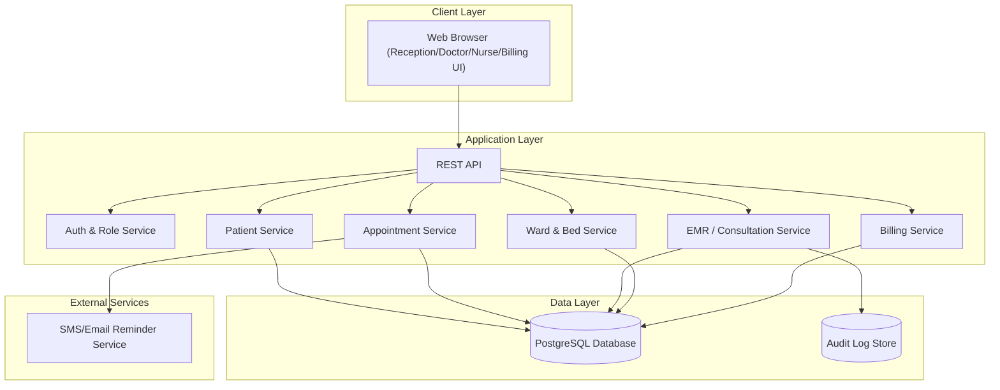
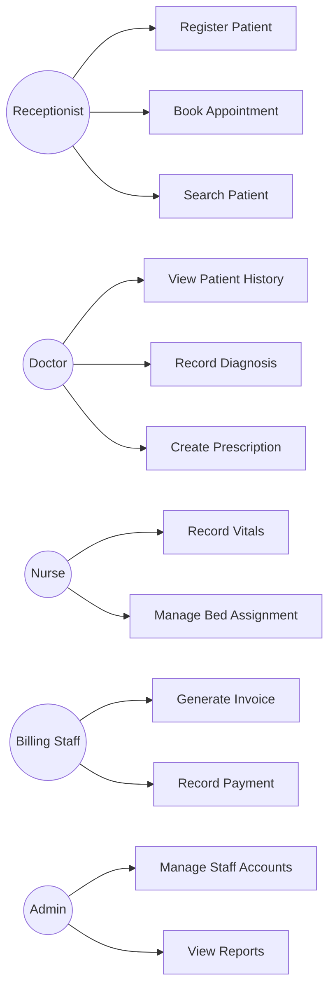
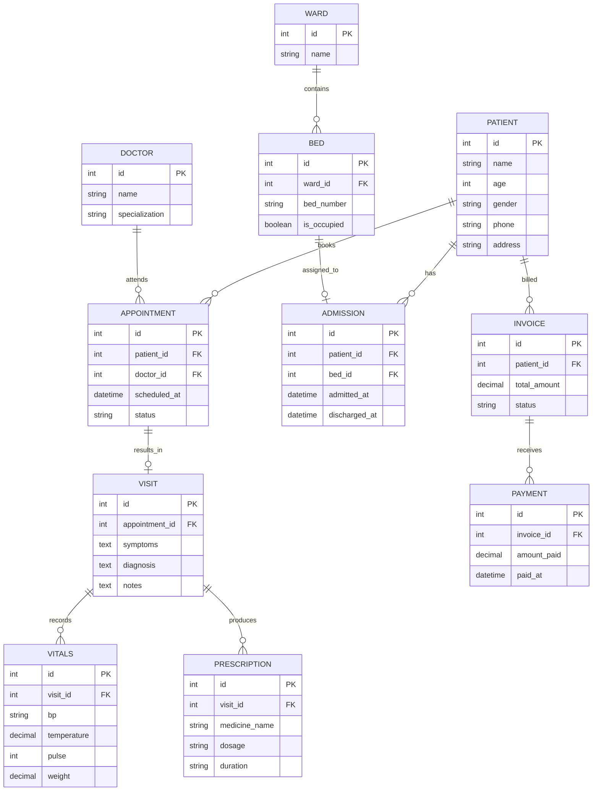
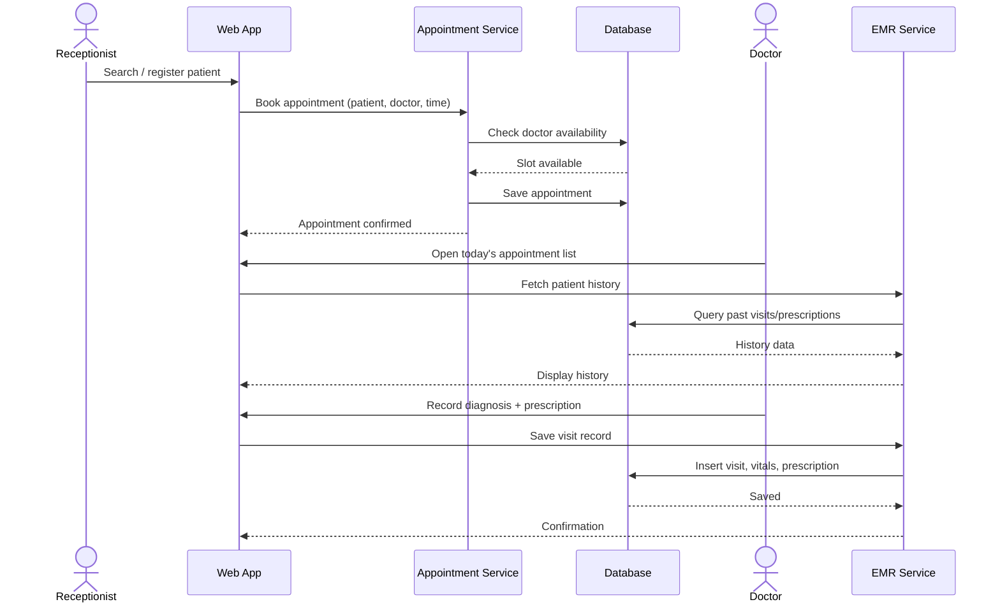
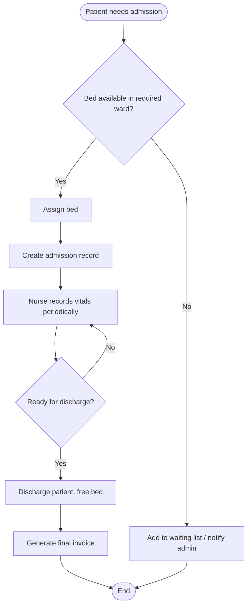

# Software Requirements Specification (SRS)
## Small Hospital Management System

**Version:** 1.0
**Date:** September 12, 2026

---

## 1. Introduction

### 1.1 Purpose
This document specifies the functional and non-functional requirements for a
Hospital Management System (HMS) intended for a small clinic or hospital. It
serves as the single reference for developers, testers, and stakeholders on
what the system must do.

### 1.2 Scope
The system, referred to as **CareTrack**, supports patient registration,
appointment scheduling, doctor consultations, prescription and basic medical
record keeping, and billing for a single-facility hospital or clinic. It does
not cover advanced modules such as insurance-claims processing, pharmacy
inventory across multiple branches, or telemedicine in this initial release.

### 1.3 Intended Audience
- Development team
- QA / testers
- Project manager / product owner
- Hospital staff (receptionists, doctors, nurses, billing staff) as end users

### 1.4 Definitions
| Term | Definition |
|---|---|
| EMR | Electronic Medical Record |
| OPD | Out-Patient Department |
| IPD | In-Patient Department (admitted patients) |
| Vitals | Basic clinical measurements (BP, temperature, pulse, weight, etc.) |
| Receptionist | Front-desk staff who register patients and book appointments |

---

## 2. Overall Description

### 2.1 Product Perspective
CareTrack is a standalone web application used within a single hospital
facility. It has a browser-based frontend, a backend API, and a relational
database. It is not part of a larger hospital-chain product family in v1.0.

### 2.2 Product Functions (Summary)
- Patient registration and search
- Appointment scheduling with doctors
- OPD consultation and diagnosis recording
- Prescription creation
- Basic in-patient (ward/bed) admission and discharge tracking
- Billing and invoice generation
- Role-based access for admin, doctor, receptionist, and billing staff

### 2.3 User Classes
| User Class | Description |
|---|---|
| Receptionist | Registers patients, books/manages appointments |
| Doctor | Views patient history, records diagnosis, writes prescriptions |
| Nurse | Records vitals, manages ward/bed assignments |
| Billing Staff | Generates and manages invoices and payments |
| Admin | Manages users, departments, and system configuration |
| Patient (optional portal) | Views own appointments and prescriptions |

### 2.4 Operating Environment
- Web frontend: modern browsers (Chrome, Firefox, Safari, Edge)
- Backend: REST API over HTTPS
- Database: PostgreSQL (or similar RDBMS)
- Hosting: on-premise server or cloud VM, depending on hospital IT policy

### 2.5 Design and Implementation Constraints
- Patient medical data must be stored and transmitted securely (encryption at
  rest and in transit).
- Access to medical records must be restricted by role (e.g., only doctors
  can edit diagnoses).
- Must support at least 50 concurrent users at launch (typical small-hospital
  staff size).
- Audit log required for all changes to medical records.

### 2.6 Assumptions and Dependencies
- The hospital has a single physical location for this release.
- Billing integrates with a simple invoicing flow; it does not integrate
  with external insurance systems in v1.0.
- An SMS/email service may be used for appointment reminders (optional).

---

## 3. Functional Requirements

### FR-1: User Authentication & Roles
- FR-1.1: The system shall allow staff to log in with a username and password.
- FR-1.2: The system shall enforce role-based access control (Admin, Doctor,
  Nurse, Receptionist, Billing).
- FR-1.3: The system shall allow an admin to create, edit, and deactivate
  staff accounts.

### FR-2: Patient Registration
- FR-2.1: The system shall allow a receptionist to register a new patient
  with name, age, gender, contact info, and address.
- FR-2.2: The system shall generate a unique patient ID for each patient.
- FR-2.3: The system shall allow searching for existing patients by name,
  ID, or phone number.

### FR-3: Appointment Scheduling
- FR-3.1: The system shall allow booking an appointment for a patient with a
  specific doctor and time slot.
- FR-3.2: The system shall prevent double-booking of a doctor's time slot.
- FR-3.3: The system shall allow rescheduling or cancelling an appointment.
- FR-3.4: The system shall display a doctor's daily/weekly appointment schedule.

### FR-4: Consultation & Medical Records
- FR-4.1: The system shall allow a doctor to view a patient's medical history
  before a consultation.
- FR-4.2: The system shall allow a doctor to record symptoms, diagnosis, and
  notes for a visit.
- FR-4.3: The system shall allow a nurse to record vitals (BP, temperature,
  pulse, weight) linked to a visit.
- FR-4.4: The system shall allow a doctor to create a prescription listing
  medicines, dosage, and duration.

### FR-5: In-Patient (Ward/Bed) Management
- FR-5.1: The system shall allow admitting a patient to a ward and assigning
  a bed.
- FR-5.2: The system shall track bed availability per ward in real time.
- FR-5.3: The system shall allow discharging a patient, freeing the bed.

### FR-6: Billing
- FR-6.1: The system shall generate an invoice covering consultation fees,
  tests, and (if applicable) ward charges.
- FR-6.2: The system shall record payments against an invoice (full or partial).
- FR-6.3: The system shall allow billing staff to view outstanding balances.

### FR-7: Reporting
- FR-7.1: The system shall allow admin to view daily patient count, revenue,
  and bed-occupancy reports.

---

## 4. Non-Functional Requirements

| Category | Requirement |
|---|---|
| Performance | Patient search results shall return within 2 seconds for a database of up to 100,000 patient records. |
| Security | All patient data shall be encrypted in transit (HTTPS) and at rest; passwords hashed (e.g., bcrypt). |
| Privacy | System shall comply with applicable health-data privacy regulations (e.g., HIPAA-equivalent local law) regarding access logging and data retention. |
| Availability | System shall target 99.5% uptime, since downtime can affect patient care. |
| Auditability | Every create/update to a medical record shall be logged with user, timestamp, and change details. |
| Usability | Core workflows (register patient, book appointment, record consultation) shall be completable in 5 steps or fewer. |
| Scalability | System shall support growth to 200 concurrent users and 500,000 patient records without redesign. |

---

## 5. System Models

### 5.1 System Architecture

### 5.2 Use Case Diagram

### 5.3 Entity-Relationship Diagram

### 5.4 Appointment & Consultation Sequence Diagram

### 5.5 Patient Admission Flow (Activity Diagram)

---

## 6. Appendix

### 6.1 Future Enhancements (Out of Scope for v1.0)
- Multi-branch / multi-facility support
- Insurance claim processing
- Pharmacy inventory management
- Lab test ordering and results integration
- Patient self-service portal (view records, book appointments online)
- Telemedicine / video consultations

### 6.2 Acceptance Criteria
Each functional requirement (FR-x.x) above is considered met when:
1. The feature is implemented and passes its corresponding test cases.
2. The feature has been verified against relevant non-functional requirements
   (e.g., security, audit logging) where applicable.
3. Role-based access has been verified so users can only perform actions
   permitted for their role.
